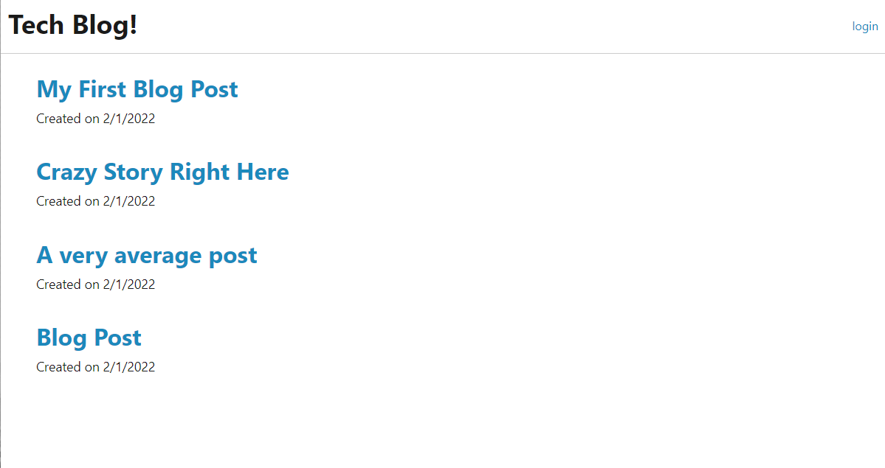

# Tech Blog

## Description  
The purpose of this application is to keep up with fellow users on whatever they feel like sharing on the site. In Tech Blog users are able to view all posts from the homepage whether that user is logged in or not. If a user does not have an account, that user will be able to create an account through the sign up portion of the login page. Once logged in, users have the ability to view all posts, create their own posts, and comment on other posts. User's also will have their own page that will display all of the posts they have made.

*Starter Code provided by Southern Methodist University Full Stack Web Development Bootcamp

## Table of Contents  
[Description](#description)    
[Usage](#usage)  
[License](#license)    
[Tests](#tests)  
[Questions](#questions)  

## Usage  

[Link to Deployed App](https://young-inlet-92393.herokuapp.com/)

## License 
MPL 2.0
[Link to License](https://www.mozilla.org/en-US/MPL/2.0/)

## Tests  
To test this application, one should create an account to ensure the sign up function is working correctly. After signing up and being redirected to the homepage, the user should try to view each post and ensure that all content is available. Try creating a post or commenting on another post to test the functionality once logged in to the site. Visit the user's dashboard to check if all posts shown are original posts. And final, try to logout.

## Questions
Link to github: [Click Here](https://github.com/colinmchale)  
Please submit any additional questions you may have in an email to colin.mchale22@gmail.com
